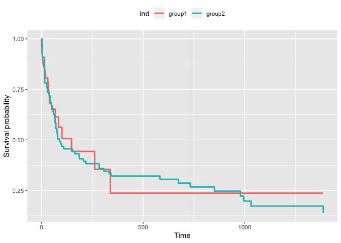

# Regularized Cox proportional hazard model with time-varying covariate
By Ruilin Li
This package provide functions that solve the Regularized Cox proportional hazard model with time-varying covariate
See DESCRIPTION and [vignettes](vignettes/) to use this package.

There are a few ways to represent time-varying covariates. In this
example I will use the Stanford Heart Transplant data to demonstrate how
to use this package when the time-varying covariate is specified by a
operation (such as a surgery). Another form of time-varying covariate
are same variables measured over time, which is easier to specify with
this package.

    library(survival)
    library(dplyr)
    N = nrow(jasa)
    jasa$ID = 1:N
    jasa$y = pmax(0.5, as.numeric(jasa$fu.date - jasa$accept.dt))
    jasa$age = jasa$age - 48
    jasa$year = as.numeric(jasa$accept.dt - as.Date("1967-10-01"))/365.25
    jasa$txtime= with(jasa, ifelse(tx.date== fu.date,
                                   (tx.date -accept.dt) -.5,
                                   (tx.date - accept.dt)))
    jasa$status = jasa$fustat

Notice that:

-   The response variable y here is the time from accept date to last
    followup, which is possibly adeath time.
-   The status variable is 1 if death happend before last followup, 0
    otherwise.
-   txtime is the waiting time of heart transplant after the patient us
    accepted.
-   In this example, the time varying covariates are the transplant
    indicator, and the interaction between transplant and age.

The jasa data frame can be readily fed into the coxtv function. Now we
put the time varying covariates into a format suitable for this package.

    # at the beginning no-one has transplant
    tv_trans = data.frame(ID=1:N, time=0, value = 0)
    tmp = jasa %>% select(c(ID, txtime)) %>% filter(!is.na(txtime))
    tmp$time = tmp$txtime
    tmp$value = 1
    tmp = select(tmp, c(ID, time, value))
    # At the transplant, the transplant indicator becomes 1
    tv_trans = rbind(tv_trans, tmp)
    # The interaction  between age and transplant
    tv_inter = tv_trans
    tv_inter$value = tv_inter$value * jasa$age[match(tv_inter$ID, jasa$ID)]
    tv_list = list(transplant = tv_trans, transplant_age = tv_inter)

Now we can fit a model

    library(coxtv)
    result = coxtv(jasa, tv_list,c('surgery', 'year', 'age'),c(0.01, 0.0))
    result
    #> [[1]]
    #>     transplant transplant_age        surgery           year            age 
    #>     0.00000000     0.02674333    -0.50728342    -0.13635015     0.01582830 
    #> 
    #> [[2]]
    #>     transplant transplant_age        surgery           year            age 
    #>     0.04449054     0.02702202    -0.62291877    -0.13600685     0.01528013

Compute the training C-index:

    cindex_tv(jasa, tv_list,c('surgery', 'year', 'age'), result[[1]])
    #> [1] 0.6837927
    cindex_tv(jasa, tv_list,c('surgery', 'year', 'age'), result[[2]])
    #> [1] 0.6813671

We can also draw a Kaplan-Meier curve based on a time varying covariate.
We use the definition defined in section four of [this
paper](https://www.jstor.org/stable/pdf/27643698.pdf?refreqid=excelsior%3A9a359cba87b05649fc535fe7fea9430e).

    KM_curve_tv(jasa, tv_list[[1]], ngroup=2)

